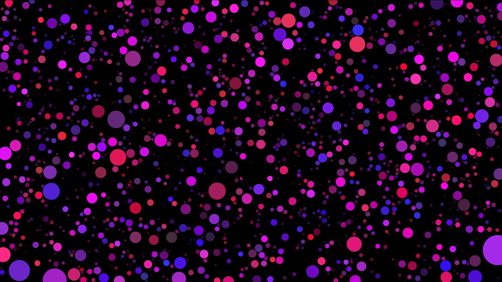

## Growing circles

Demo: https://growing-circles.netlify.app/

Full-screen animation which generates growing non-intersecting circles on the whole canvas. When two circles touch each other, they start to shrink and lose opacity. When a circle is very small, it starts to grow again.

